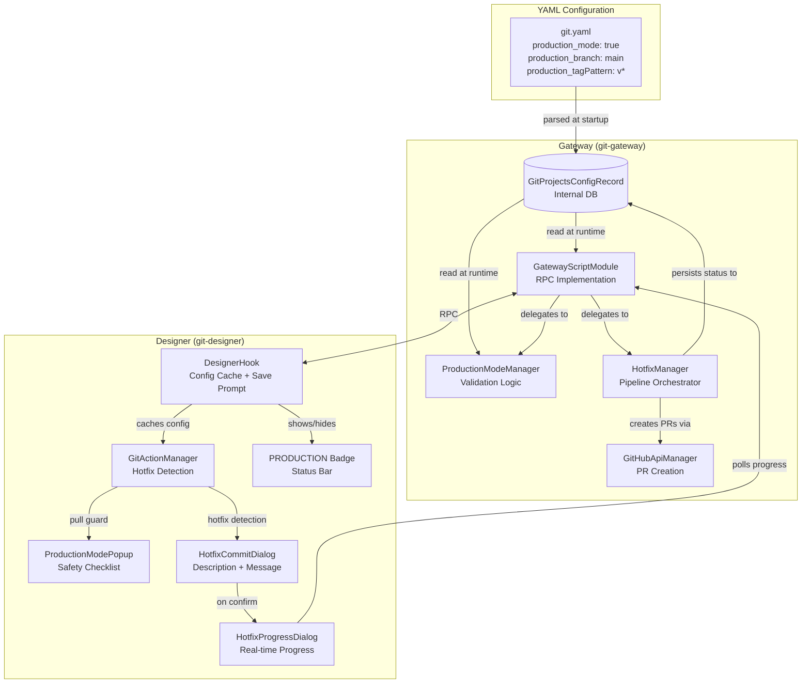
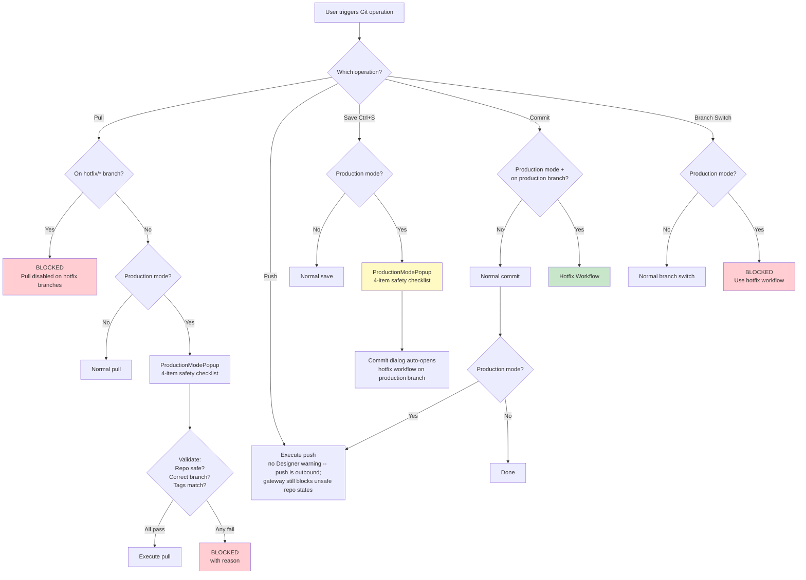
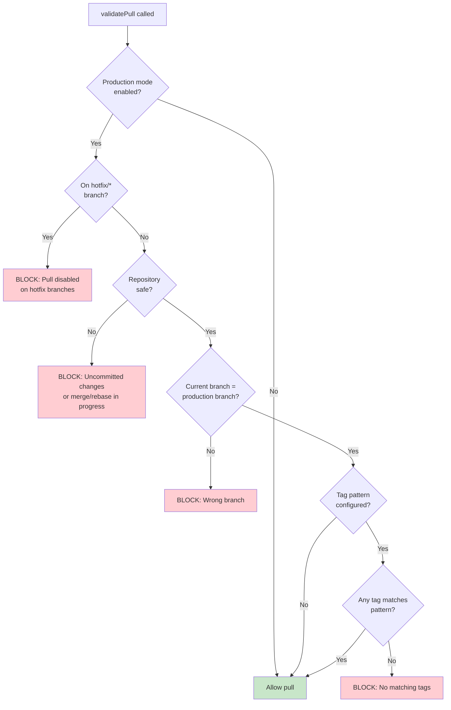
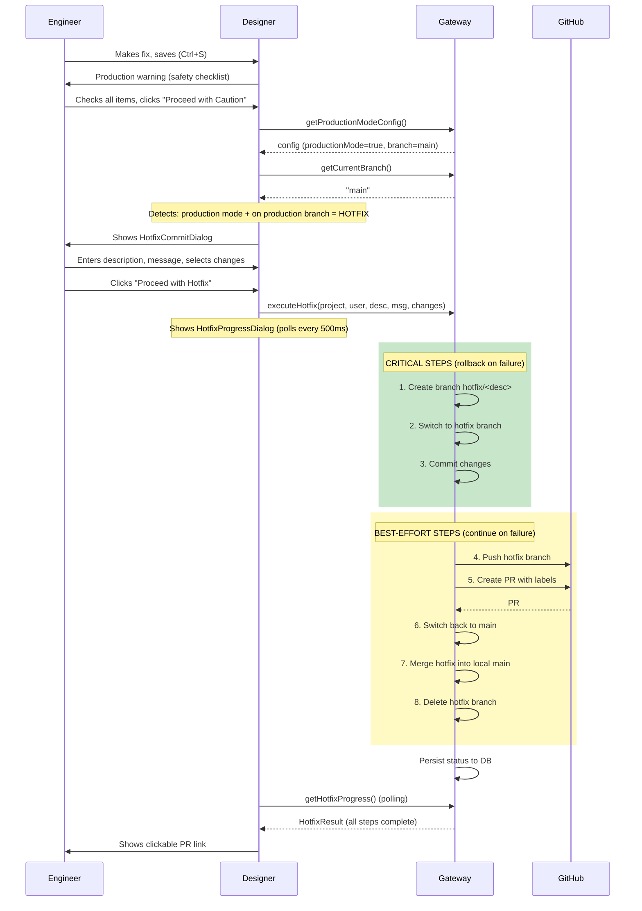
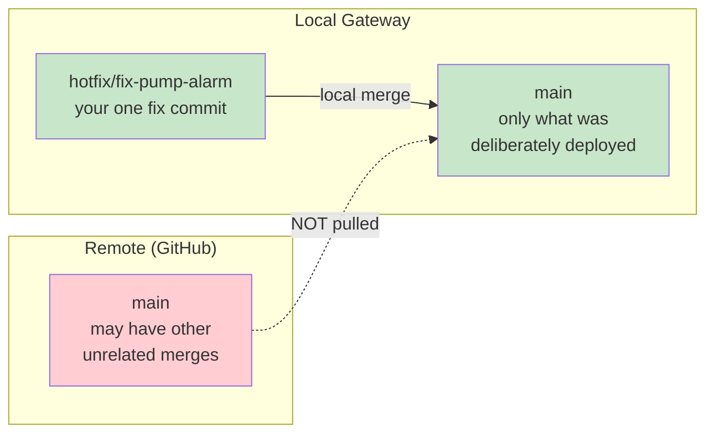
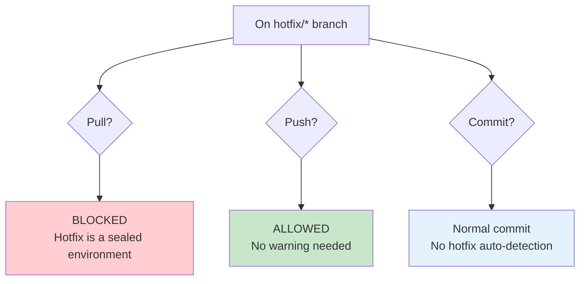
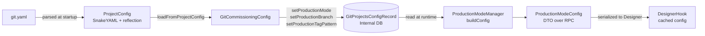

# Production Mode

Production mode is a safety layer that protects production Ignition gateways from accidental or uncontrolled Git operations. When enabled, it enforces validation checks, requires explicit confirmation for risky operations, and provides an automated hotfix workflow for emergency changes.

## Architecture Overview



## Configuration

### YAML (Recommended for Automated Deployments)

Add production mode fields to your project entry in `git.yaml`:

```yaml
- repo_uri: https://github.com/YourOrg/your-ignition-project.git
  repo_branch: main
  ignition_projectName: MyProject
  ignition_userName: admin@company.com
  user_name: github-user
  user_email: admin@company.com
  user_password: placeholder
  # ... other fields ...

  # Production mode settings
  production_mode: true
  production_branch: main
  production_tagPattern: "v*"
```

| Field | Type | Description |
|-------|------|-------------|
| `production_mode` | boolean | Enable production mode for this project |
| `production_branch` | string | The protected production branch (e.g., `main`, `master`, `production`) |
| `production_tagPattern` | string | Tag pattern to validate (wildcard or regex). At least one tag must match. |

Production mode settings are synced to the internal database on every gateway startup. Changes to `git.yaml` take effect after a gateway restart.

### Tag Pattern Syntax

The `production_tagPattern` field supports two formats:

**Wildcard patterns** (detected by the presence of `*` or `?`):
- `v*` matches `v1.0.0`, `v2.3.4-beta`, `v10.20.30`
- `release-?` matches `release-1`, `release-A`
- `v?.?.?` matches `v1.2.3` but not `v10.20.30`

**Regex patterns** (if no `*` or `?` is present):
- `^v\d+\.\d+\.\d+$` for strict semver matching
- `^release-\d+$` for numbered releases

If no tag pattern is specified, tag validation is skipped.

## What Production Mode Does

### Designer Indicators

When production mode is active, the Designer shows:

- A red **PRODUCTION** badge in the Git status bar (bottom of Designer window)
- Warning dialogs before risky operations

### Operation Guards



### Repository Safety Checks

Before pull or push operations, the module verifies:

1. **Repository state is SAFE** -- not in the middle of a merge, rebase, or cherry-pick
2. **No uncommitted changes** to tracked files (modified, added, or removed)

Untracked files are intentionally ignored since Ignition may create temporary files in the project directory.

When a check fails, the error names the offending paths (up to 10, then a count of the remainder) so the problem can be resolved without shelling into the gateway:

```
Production mode: cannot push because the repository has 3 uncommitted change(s):
  • com.inductiveautomation.perspective/views/Overview/view.json
  • ignition/script-python/util/code.py
  • tags/default/.tag-groups.json
Commit or discard them before proceeding.
```

### Why a partial commit blocks the push

In production mode a commit auto-pushes. Both commit dialogs let you select a subset of the
changed resources — and anything you leave unselected keeps the working tree dirty, which makes
the push fail the safety check above. The commit still succeeds; only the push is skipped, and
the message says so explicitly along with what is still outstanding.

If you want the push to go through, commit or discard everything, or push manually once the tree
is clean.

### Pull Validation Flow



## Hotfix Workflow

When a control engineer needs to make an emergency fix on a production gateway, the hotfix workflow provides a controlled path that maintains full Git traceability.

### End-to-End Flow



### How It Works

1. **Engineer makes a fix** in the Ignition Designer (edits a script, modifies a view, etc.)
2. **Saves the project** (Ctrl+S)
3. **Module shows the production warning** -- the 4-item safety checklist (`ProductionModePopup`), since the save is what changed the gateway
4. **Engineer confirms** -- the commit dialog opens automatically and the module detects the hotfix scenario (production mode + on production branch)
5. **Hotfix Commit Dialog appears** -- the engineer provides:
   - A short **hotfix description** (used in branch name and PR title)
   - A **commit message** explaining the fix
   - Selects which **changed resources** to include
6. **Engineer clicks "Proceed with Hotfix"** -- the automated pipeline runs
7. **Progress dialog** shows real-time status of each step with a clickable PR link on completion

### Pipeline Steps

| # | Step | Git Operation | Failure Handling |
|---|------|---------------|------------------|
| 1 | Create hotfix branch | `git branch hotfix/<name>` | Rollback, report error |
| 2 | Switch to hotfix branch | `git checkout hotfix/<name>` | Delete branch, report error |
| 3 | Commit changes | `git add <files> && git commit` | Switch back, delete branch, report error |
| 4 | Push hotfix branch | `git push <remote> hotfix/<name>` | Warn user, continue with local steps |
| 5 | Create PR | GitHub REST API | Warn user, continue with local steps |
| 6 | Switch back to main | `git checkout main` | Warn user |
| 7 | Merge hotfix into local main | `git merge hotfix/<name>` | Warn user |
| 8 | Delete local hotfix branch | `git branch -d hotfix/<name>` | Non-critical, log only |

### Why Local Merge (Not Remote Pull)



After the hotfix, the module merges the hotfix branch into the **local** production branch rather than pulling from the remote. This is critical: the remote production branch may contain other merged changes not intended for this gateway. The local merge only brings in the engineer's fix.

### Unpushed Production Commits

The pipeline pushes only the `hotfix/*` branch. The local production branch is never pushed, so
after a hotfix the gateway is **one commit ahead of the remote** until someone merges the pull
request. Until that happens, the gateway is running code that exists in no shared branch.

Production mode surfaces this rather than assuming the PR gets merged:

- **Pull in production mode** shows an amber *Unpushed Production Commits* panel in the safety
  dialog, naming each commit (short hash + subject) that the remote has not seen.
- The same text is logged at `WARN` on the gateway.
- It is available over RPC as `getUnpushedProductionCommits(projectName)`, which returns `null`
  when there is nothing to report. (Not currently part of the curated `system.git.*` facade.)

**This is advisory and never blocks a pull.** Two reasons:

1. Being ahead is the *expected* state right after a hotfix, not an error.
2. If the PR is squash-merged, the remote gets an equivalent commit with a **different hash**, so
   the branch reads as permanently ahead. Blocking on that would strand the gateway.

> **Freshness caveat:** the comparison is against the remote-tracking ref, so it is only as current
> as the last fetch — hence the "as of the last fetch" wording in the message. A PR merged since
> the last fetch still reads as unpushed until the gateway fetches again.

#### Recommended repository setting

For repositories backing a production gateway, prefer **merge commits** (or rebase) over
**squash** when merging hotfix PRs:

| GitHub merge button | Lands on the remote | Next gateway pull |
|---|---|---|
| Merge commit | The exact hotfix commit hash | Clean fast-forward |
| Squash | A new commit, same content, new hash | Histories permanently forked |
| Rebase | Rewritten hash | Histories permanently forked |

With a merge commit the gateway's history reconciles cleanly on the next pull and the advisory
clears itself.

### Hotfix Branch Rules

When on a `hotfix/*` branch, production mode behavior changes:



A hotfix branch is a **sealed environment** -- the engineer's fix and nothing else. The only way changes enter is through their commits. The only way it reaches remote is through push. No pulls, no merges from other branches.

### GitHub PR

The hotfix workflow automatically creates a GitHub Pull Request with:

- **Title:** `HOTFIX: <description>`
- **Labels:** `hotfix`, `production`
- **Body:** Includes metadata table (who, when, which gateway, which project, commit hash), list of changed resources, and commit message
- Clearly marked as **"Already Live"** -- the fix is already running on production

The PR exists for review and traceability. Merging it on GitHub propagates the fix to the main branch for other environments.

### Authentication

PR creation reuses the existing Git credentials (the PAT stored in the user's password field). The token needs `repo` scope to create PRs and add labels. If using SSH authentication, PR creation is skipped (SSH keys can't authenticate to the GitHub REST API).

## Data Flow

### Configuration Loading



### Designer Config Caching

The Designer caches the `ProductionModeConfig` to avoid RPC calls on every save:

| Event | Action |
|-------|--------|
| Designer startup | Fetch and cache config |
| Every 5 minutes | Background refresh |
| After branch switch | Invalidate cache |
| After pull | Invalidate cache |
| After hotfix completion | Invalidate cache |

## Admin Visibility

### Gateway Logs

All hotfix operations are logged at INFO/WARN level with a `[Production Hotfix]` prefix:

```
[Production Hotfix] INITIATED by 'jsmith' on project 'WHK-MES': hotfix/fix-pump-alarm
[Production Hotfix] Branch created: hotfix/fix-pump-alarm
[Production Hotfix] Committed: abc1234 "Fix pump alarm threshold"
[Production Hotfix] Pushed to remote
[Production Hotfix] PR #42 created: https://github.com/YourOrg/repo/pull/42
[Production Hotfix] Local merge to main completed
[Production Hotfix] COMPLETED SUCCESSFULLY
```

On failure:
```
[Production Hotfix] Push FAILED: authentication error
[Production Hotfix] PR creation SKIPPED (push failed)
[Production Hotfix] COMPLETED WITH WARNINGS -- push failed, manual intervention needed
```

### Database Status

The last hotfix result is persisted in `GitProjectsConfigRecord`:

| Field | Description |
|-------|-------------|
| `LastHotfixStatus` | `COMPLETED`, `COMPLETED_WITH_WARNINGS`, or `FAILED` |
| `LastHotfixTimestamp` | Unix timestamp (milliseconds) of when the hotfix ran |
| `LastHotfixUser` | Ignition username of the engineer who applied the hotfix |
| `LastHotfixBranch` | Branch name (e.g., `hotfix/fix-pump-alarm`) |
| `LastHotfixPRUrl` | GitHub PR URL (null if PR creation failed or was skipped) |

## Troubleshooting

### "Pull is disabled on hotfix branches"

You're on a hotfix branch (e.g., `hotfix/fix-something`). This means a previous hotfix didn't complete cleanup. To resolve:

```bash
docker exec -it <container> bash
cd /usr/local/bin/ignition/data/projects/<project>
git checkout main
git branch -D hotfix/fix-something
```

### Pull validation fails with "Repository is not in a safe state"

The project's Git repository has uncommitted changes to tracked files or is in a merge/rebase state. To resolve:

```bash
docker exec -it <container> bash
cd /usr/local/bin/ignition/data/projects/<project>
git status          # See what's dirty
git checkout -- .   # Discard changes (if safe)
git merge --abort   # If in merge state
```

### Pull validation fails with "does not match production branch"

You're not on the configured production branch. This can happen if the gateway was manually switched to another branch. To resolve:

```bash
docker exec -it <container> bash
cd /usr/local/bin/ignition/data/projects/<project>
git checkout main   # Or whatever your production_branch is
```

### Pull validation fails with "tags do not match pattern"

No tags in the repository match the configured `production_tagPattern`. Either:
- The repository hasn't been tagged yet -- create a tag matching the pattern
- The pattern is wrong -- check `production_tagPattern` in `git.yaml`
- Tags weren't fetched -- the pull operation fetches tags automatically, but if this is the first pull after setup, you may need to fetch manually

### Hotfix push failed

The commit exists locally but wasn't pushed. Check credentials:
- Verify the PAT in the user record has push permissions
- For SSH repos, verify the SSH key is correct

You can push manually:
```bash
docker exec -it <container> bash
cd /usr/local/bin/ignition/data/projects/<project>
git push origin hotfix/<branch-name>
```

### Hotfix PR creation failed

The push succeeded but the PR wasn't created. Common causes:
- PAT doesn't have `repo` scope -- update the token
- Repository URL isn't a GitHub URL -- PR creation only works with `github.com` repos
- SSH authentication -- PR creation requires HTTPS with a PAT

You can create the PR manually on GitHub from the pushed hotfix branch.

### Production mode not activating after YAML change

Production mode settings are synced on gateway startup. After changing `git.yaml`:
1. Restart the gateway
2. Restart the Designer (to pick up the cached config)

Verify the settings were persisted by checking the gateway logs for:
```
Successful addition of field: production_mode: true
```

### Branch switching shows "disabled in production mode"

This is expected behavior. In production mode, all branching is handled by the hotfix workflow. If you need to switch branches for maintenance, you must do it via the gateway container's command line.

### Progress dialog shows all grey/blank icons

This was a known timing issue (fixed). If you encounter it:
1. Close the dialog
2. Check gateway logs for `[Production Hotfix]` entries -- the pipeline likely completed successfully
3. Restart the Designer and retry

The fix ensures the completed pipeline result stays in memory until the progress dialog reads it.
