# Ignition Git Module

[](LICENSE.md)

A free Ignition module that embeds a full-featured Git client directly into the Ignition Designer. Manage commits, branches, merges, stashes, and gateway configuration — all without leaving the IDE.

Requires **Ignition 8.3.1+** and **Java 17+**.

## Version Compatibility

| Module Version | Ignition Version | Status | Download |
|---------------|------------------|---------|----------|
| v1.x (≤1.0.3) | 8.1.x | ⚠️ End of Life | [v1.0.3-ignition-8.1](https://github.com/WhiskeyHouse/ignition-git-module/releases/tag/v1.0.3-ignition-8.1) |
| v2.x (≥2.0.0) | 8.3.1+ | ✅ Active Development | [Latest Release](https://github.com/WhiskeyHouse/ignition-git-module/releases) |

### Breaking Changes in v2.0.0

**Version 2.0.0 and higher require Ignition 8.3.1 or later** and are NOT backwards compatible with 8.1.x.

**Major Changes:**
- Migrated from Java serialization to **Protobuf RPC** for improved performance and security
- Updated to Ignition 8.3 **React-based web framework** for Gateway configuration pages
- Changed RPC method signatures (Dataset → strongly-typed DTOs for better serialization)
- New module hook patterns following Ignition 8.3 standards
- Requires **Java 17+** (Ignition 8.3 requirement)

**If you're using Ignition 8.1.x**, please use the [v1.0.3-ignition-8.1 release](https://github.com/WhiskeyHouse/ignition-git-module/releases/tag/v1.0.3-ignition-8.1).

## Features

### Repository Management (Gateway Web UI)

- **Git Projects Config** — Link Ignition projects to remote Git repositories
- **Git Users Config** — Per-user authentication with HTTPS password or SSH key
- **Multi-project support** — Track multiple Ignition projects independently

### Commit & Push/Pull (Designer)

- **Commit** — Select specific resources to commit with a custom message
- **Search & filter** — Filter uncommitted changes by name, type, or author in the commit popup
- **Push** — Push commits to the remote repository
- **Pull** — Fetch and merge from remote, with options to import tags, themes, and images
- **Import resources** — Import tags, themes, or images from the local repo independently, with collision policy (Overwrite, Merge, Abort)

### Branch Management (Designer)

- **List branches** — View all local and remote branches with ahead/behind status
- **Switch branches** — Check out any branch, with force-checkout option
- **Create branches** — Create new branches from the branch popup
- **Fetch from remote** — Update remote branch metadata

### Stash (Designer)

- **Stash changes** — Save uncommitted work with an optional message
- **Pop stash** — Restore previously stashed changes

### Merge Conflict Resolution (Designer)

- **Detect conflicts** — Automatic detection when the repository enters a merge state
- **Resolve conflicts** — Choose "Keep Ours" or "Accept Theirs" strategy
- **Abort merge** — Cancel and return to pre-merge state

### Commit History (Designer)

- **View history** — Browse the 100 most recent commits
- **Commit details** — Hash, message, author, timestamp, and files changed
- **Search** — Filter commits by filename

### Configuration Export (Designer)

- **Export gateway config** — Export tags, images, and themes to the repository
- **Multi-project warnings** — Alerts when exporting shared gateway resources

### Discard Changes (Designer)

- **Discard all** — Permanently discard all uncommitted changes

### Designer UI

- **Toolbar** — Quick access to all Git operations from the project context menu
- **Status bar** — Shows current branch information
- **Documentation viewer** — Browse project markdown docs with Mermaid diagram support

## Screenshots

### Gateway Configuration

Gateway navigation showing the Git config section:

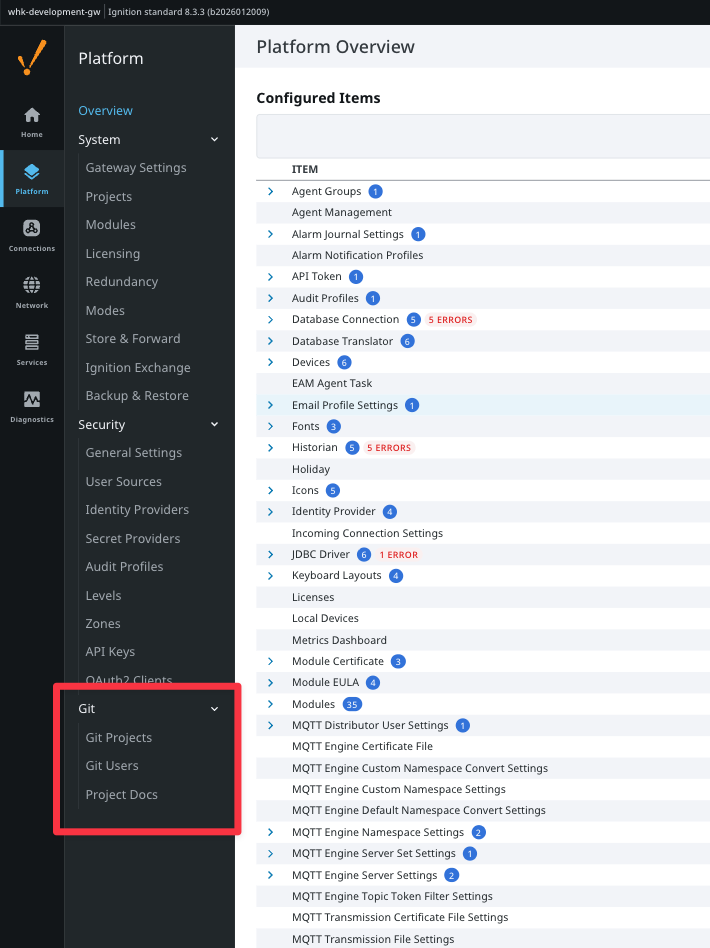

Git Projects — list of linked repositories:

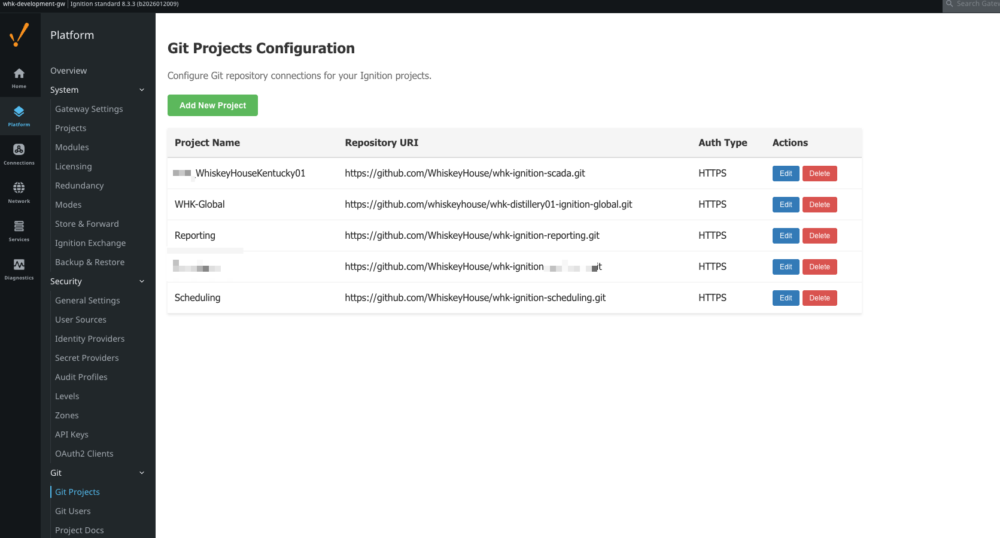

Git Projects — edit project configuration:

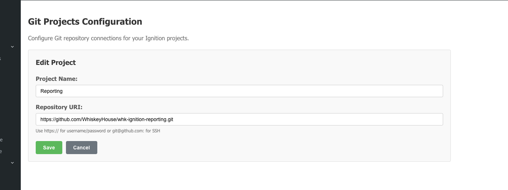

Git Users — per-project user credentials:

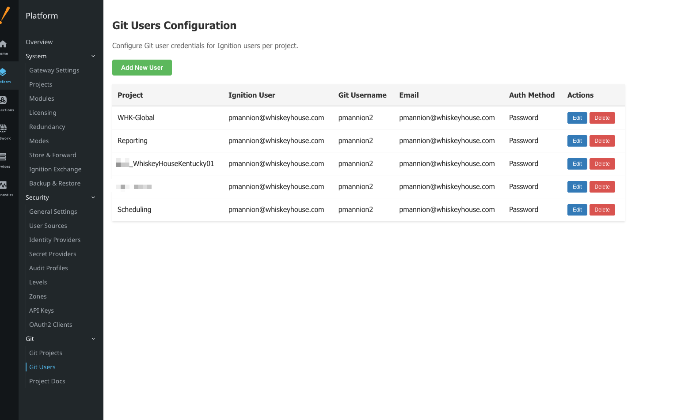

Git Users — edit user authentication:

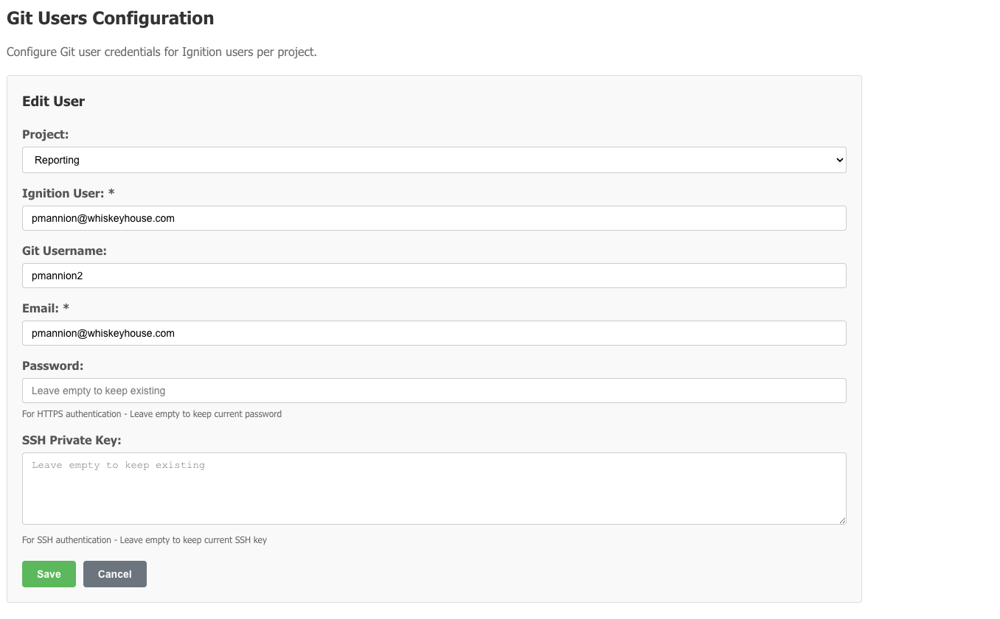

### Designer

Git toolbar icons (pull, push, commit, branch, history, export, import, docs):

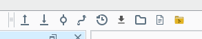

Commit popup with search/filter and change list:

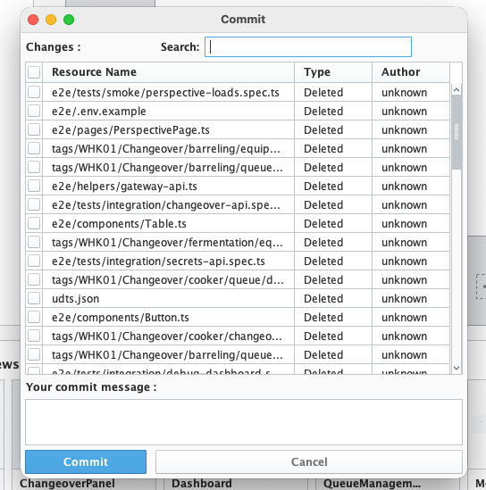

Branch popup with stash, discard, and conflict resolution:

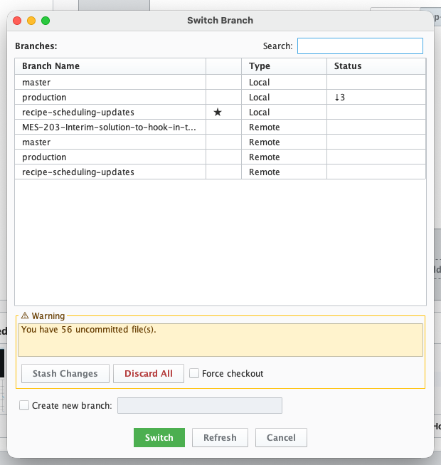

Commit history viewer with file search:

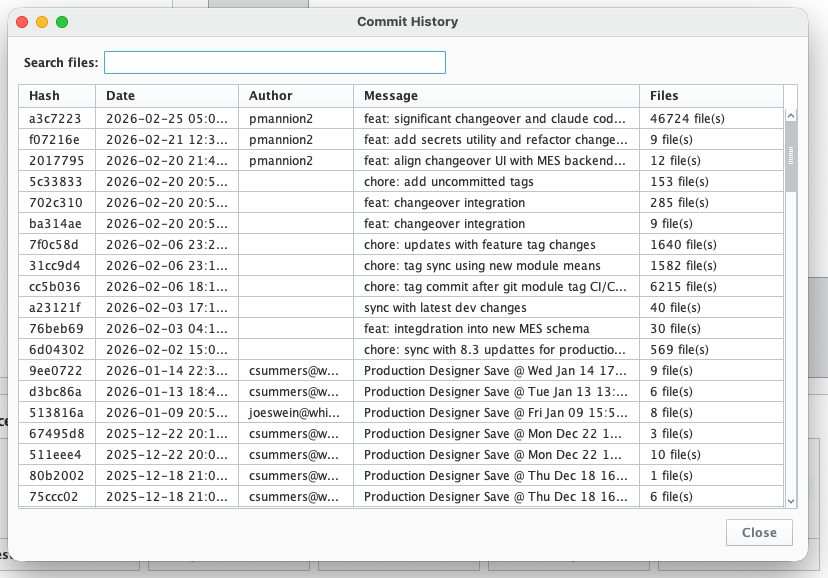

Import resources popup with collision policy:

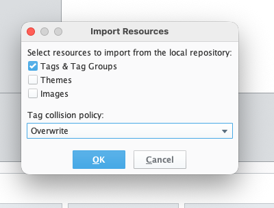

Documentation viewer integration in context menu:

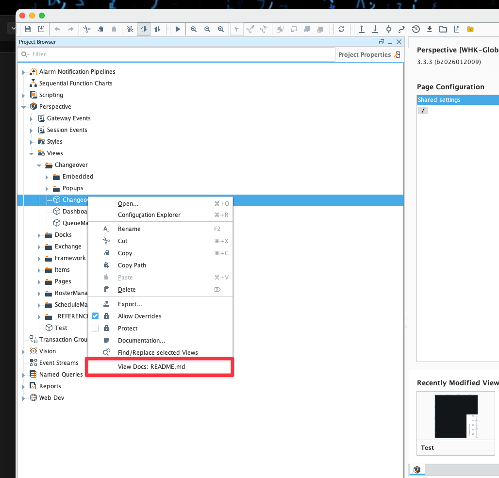

## Installation for Development

### Prerequisites

- Java (JDK >= 17) — Required for Ignition 8.3+
- Maven
- Node.js (>= 18) — Required for building React components

### Build & Install

1. Clone the repo: `git clone https://github.com/WhiskeyHouse/ignition-git-module.git`
2. Build with Maven: `mvn clean package`
3. The `.modl` file will be at `git-build/target/Git-unsigned.modl`
4. Install the module on your gateway via **Config > System > Modules**

## YAML Automated Commissioning

The module supports automated project commissioning via Docker Compose. Place a `git.yaml` file in the `gw-init` directory with your repository configurations:

```yaml
- repo_uri: https://github.com/exampleUser/my-repo-global.git
  repo_branch: development
  ignition_projectName: Global
  ignition_userName: admin
  ignition_inheritable: true
  ignition_parentName: null
  user_name: my-github-username
  user_email: cooldev@myorg.com
  user_password: placeholder  # Real token provided via GATEWAY_GIT_USER_SECRET env var
  commissioning_importThemes: true
  commissioning_importTags: true
  commissioning_importImages: true
  initDefaultBranch: main
- repo_uri: https://github.com/exampleUser/my-repo.git
  repo_branch: development
  ignition_projectName: childProject
  ignition_userName: admin
  ignition_inheritable: false
  ignition_parentName: Global
  user_name: my-github-username
  user_email: cooldev@myorg.com
  user_password: placeholder  # Real token provided via GATEWAY_GIT_USER_SECRET env var
  commissioning_importThemes: true
  commissioning_importTags: true
  commissioning_importImages: true
```

### Automatic tag re-import on restart

Ignition stores tags in the gateway's internal database, so a gateway restart
restores tags from gateway state — not from the git working tree. To re-sync
git-tracked tags into the live providers automatically after every restart,
set the per-project flag:

```yaml
  tags_importOnStartup: true
```

When enabled, the module waits for tag providers to come up (polling every 5s,
giving up after 2 minutes with a logged warning) and then imports that
project's `tags/` directory from disk — no pull, no git operations, no
Designer interaction. Failures are logged per project and never block gateway
startup.

> **Warning:** Tag providers are gateway-wide and imports are last-writer-wins.
> If multiple projects track the same provider, enable `tags_importOnStartup`
> only on the authoritative project (same guidance as `commissioning_importTags`).
>
> **Deployment order matters:** older module versions reject unknown `git.yaml`
> keys — on a gateway still running a pre-`tags_importOnStartup` module, a
> `git.yaml` containing this key will fail commissioning for that project
> (logged, but the project is not synced). Upgrade the module on **all**
> gateways sharing the `git.yaml` before adding this key.

Unlike `commissioning_importTags` (which imports tags as part of the full
commissioning clone/sync and mutates the working tree), `tags_importOnStartup`
imports **only tags**, from whatever is currently on disk.

This supports multi-project import with project inheritance. See the [Docker example](docker/) in this repo for a working setup.

## Release Pipeline

This project uses automated GitHub Actions workflows for building and releasing:

- **Continuous Integration**: Automatically builds and tests on PRs and main branch
- **Automated Releases**: Tag-based releases with signed module files

For detailed information about creating releases, code signing, and the release process, see [RELEASE.md](RELEASE.md).

## Roadmap

- Configurable export options (select tag providers, folders, etc.)
- Side panel for commit management (VS Code-style)
- Vision project management (auto-export bin files to XML)
- Prevent duplicate user registration per project

## Contributing

We welcome contributions! To get started:

1. Fork the repo and clone your fork
2. Create a feature branch: `git checkout -b feature/describe-your-feature`
3. Make your changes and commit: `git commit -m "Add: describe your feature"`
4. Push to your fork: `git push origin feature/describe-your-feature`
5. Open a pull request explaining your changes

## Acknowledgments

This module began as a fork of the original [AXONE-IO](https://www.axone-io.com/) Ignition Git module created by Enzo Sagnelonge. It has since been substantially rewritten and extended, and is now developed and maintained independently by [WhiskeyHouse](https://github.com/WhiskeyHouse). Our thanks to the original authors for the foundation it was built on.

## Contact

Patrick Mannion — [WhiskeyHouse](https://github.com/WhiskeyHouse)

## License

This project is licensed under the Beerware license. See [LICENSE.md](LICENSE.md) for details.
